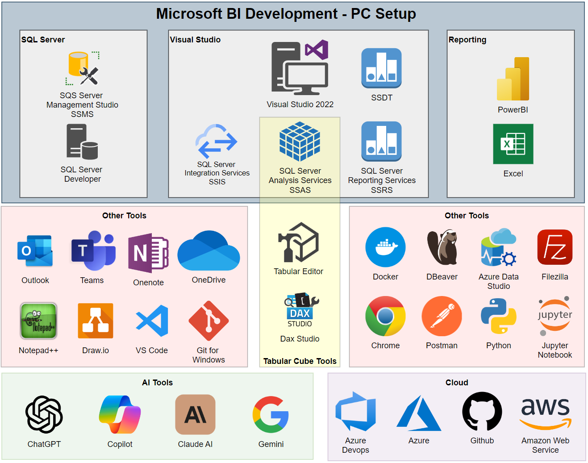

# PC Setup for BI Consulting

This section outlines all the tools and software installed on my PC for BI consulting. It provides direct links to download the tools and information about their purpose.

## Tools List

### SQL Server Tools
- **[SQL Server Developer Edition](https://www.microsoft.com/en-us/sql-server/sql-server-downloads)**: For hosting SQL databases and practicing database development.
- **[SQL Server Management Studio (SSMS)](https://docs.microsoft.com/en-us/sql/ssms/download-sql-server-management-studio-ssms)**: A tool for managing SQL Server instances, databases, and queries.

### Visual Studio Tools
- **[Visual Studio 2022 with SSDT (SQL Server Data Tools)](https://visualstudio.microsoft.com/vs/features/ssdt/)**: An IDE for developing and deploying BI solutions, including database projects.
- **[SQL Server Integration Services (SSIS)](https://docs.microsoft.com/en-us/sql/integration-services/sql-server-integration-services)**: For designing data integration and workflow applications.
- **[SQL Server Analysis Services (SSAS)](https://docs.microsoft.com/en-us/analysis-services/)**: A tool for developing OLAP cubes and tabular models.
- **[SQL Server Reporting Services (SSRS)](https://docs.microsoft.com/en-us/sql/reporting-services/)**: A server-based report generating software system from Microsoft.

### Reporting Tools
- **[Power BI Desktop](https://powerbi.microsoft.com/en-us/desktop/)**: A tool for creating business intelligence reports and dashboards.
- **[Microsoft Excel](https://www.microsoft.com/en-us/microsoft-365/excel)**: For analyzing data, creating reports, and connecting to various data sources.

### Tabular Cube Tools
- **[Tabular Editor](https://tabulareditor.com/)**: A tool for authoring, maintaining, and managing tabular models.
- **[DAX Studio](https://daxstudio.org/)**: A tool for executing and analyzing DAX queries.

### Other Tools
- **[Outlook](https://outlook.live.com/)**: Microsoft email service.
- **[Teams](https://www.microsoft.com/en/microsoft-teams/group-chat-software)**: A collaboration platform for chat, meetings, and file sharing.
- **[OneNote](https://www.microsoft.com/en-us/microsoft-365/onenote)**: For organizing notes and project documentation.
- **[OneDrive](https://www.microsoft.com/en-us/microsoft-365/onedrive/online-cloud-storage)**: A cloud storage service for saving files and photos.
- **[Notepad++](https://notepad-plus-plus.org/downloads/)**: A powerful text editor for working with code and plain text.
- **[Draw.io](https://github.com/jgraph/drawio-desktop/releases)**: A diagramming tool for creating flowcharts and other visuals.
- **[Visual Studio Code (VS Code)](https://code.visualstudio.com/)**: A lightweight editor for coding and working with various file formats, including Markdown and JSON.
- **[Git for Windows](https://gitforwindows.org/)**: A version control system for managing source code.

### Other Development Tools
- **[Docker](https://www.docker.com/products/docker-desktop)**: For containerization and deployment of applications in isolated environments.
- **[DBeaver](https://dbeaver.io/download/)**: A universal database management tool that works with a variety of databases.
- **[Azure Data Studio](https://docs.microsoft.com/en-us/sql/azure-data-studio/download-azure-data-studio)**: A cross-platform database tool for managing SQL Server and Azure databases.
- **[FileZilla](https://filezilla-project.org/download.php)**: A popular FTP client for transferring files between local and remote servers.
- **[Chrome](https://www.google.com/chrome/)**: Web browser for general web access.
- **[Postman](https://www.postman.com/downloads/)**: A tool for testing APIs and sending HTTP requests.
- **[Python](https://www.python.org/downloads/)**: A programming language often used for scripting, automation, and data analysis.
- **[Jupyter Notebook](https://jupyter.org/install)**: An open-source web application for creating and sharing documents that contain live code, equations, visualizations, and narrative text.

### AI Tools
- **[ChatGPT](https://chat.openai.com/)**: An AI-based language model for generating human-like text.
- **[GitHub Copilot](https://github.com/features/copilot)**: An AI-powered coding assistant for various programming languages.
- **[Claude AI](https://www.anthropic.com/product)**: An AI assistant developed by Anthropic.
- **[Google Gemini](https://gemini.google.com)**: A suite of generative AI tools developed by Google.

### Cloud Tools
- **[Azure DevOps](https://azure.microsoft.com/en-us/services/devops/)**: A set of tools for collaborating on code development, building, and deploying applications.
- **[Azure](https://azure.microsoft.com/)**: Microsoft's cloud platform for building, testing, and managing applications.
- **[GitHub](https://github.com/)**: A Git repository hosting service for version control and collaboration.
- **[Amazon Web Services (AWS)](https://aws.amazon.com/)**: A cloud computing platform offering a wide variety of services.

## Visual Representation of the Setup

Below is a screenshot of the `.drawio` file that provides a visual representation of the PC setup for BI consulting:

If you want to explore the diagram in more detail, you can open the `.drawio` file with draw.io:

## How to Open the `.drawio` File

The setup folder includes a `.drawio` file that provides a visual representation of the PC setup for BI consulting. To open this file:

1. Download and install [draw.io Desktop](https://github.com/jgraph/drawio-desktop/releases) if you don't have it installed, or use the [online version](https://app.diagrams.net/).
2. Open the `.drawio` file by launching draw.io and selecting **File > Open from** within the application.
3. Navigate to the location of the `.drawio` file and open it.

This diagram will help you understand the complete PC setup visually and how the tools fit together.
