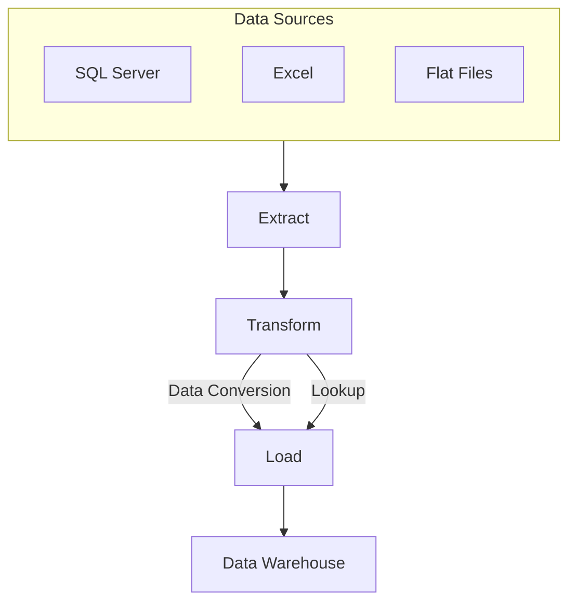
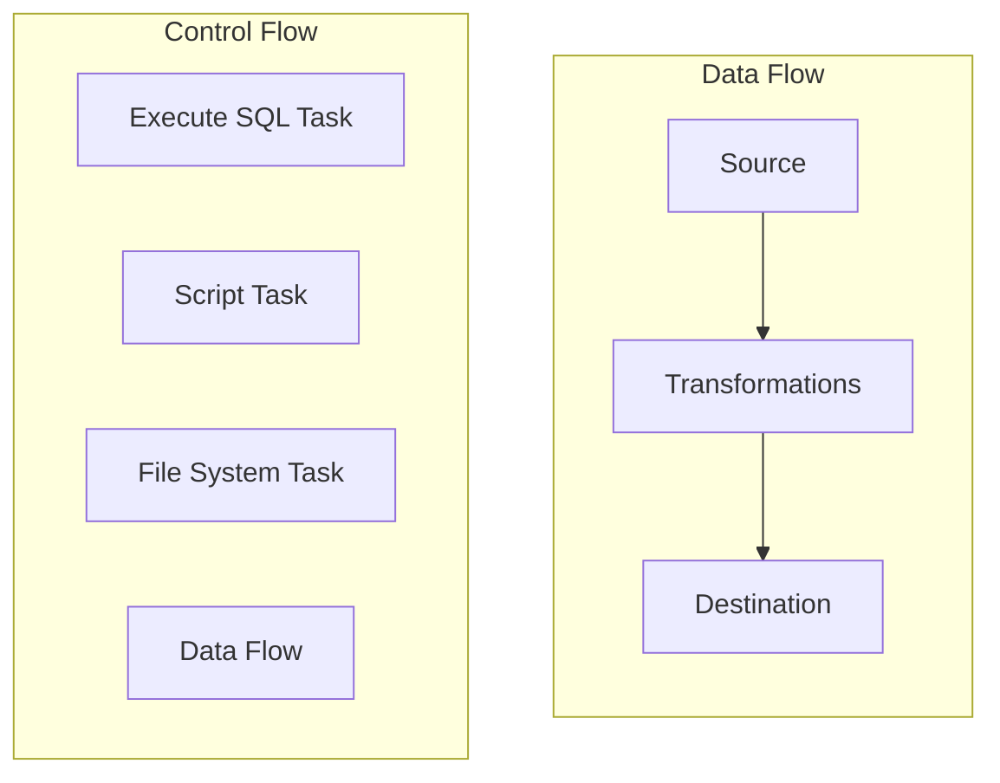
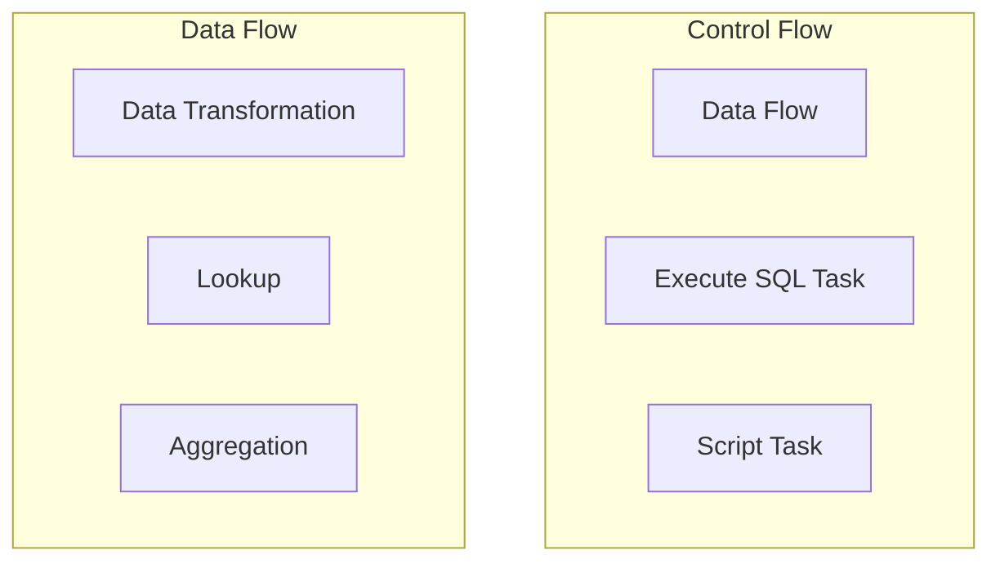
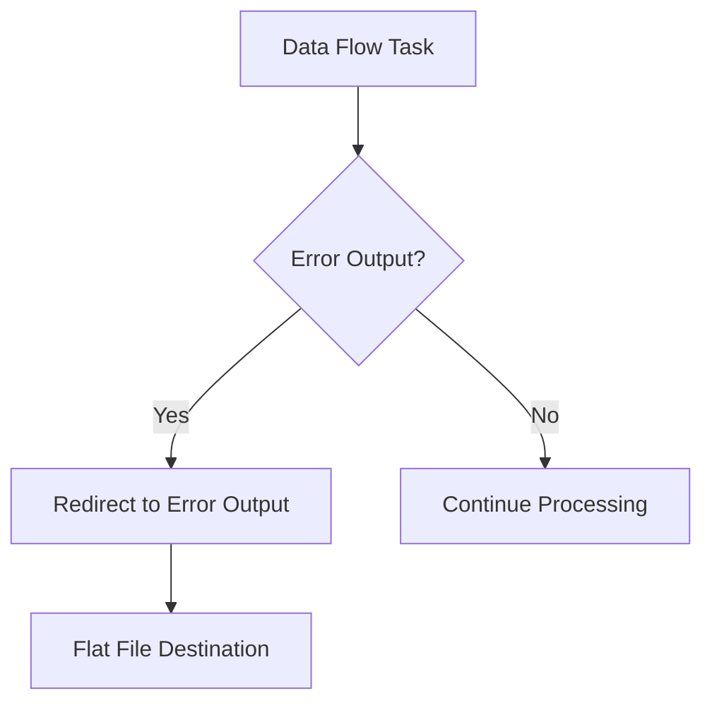

# SSIS Introduction Visuals and Diagrams

This document contains a collection of visuals and diagrams to help explain the foundational concepts of SQL Server Integration Services (SSIS). These visuals will be helpful for anyone looking to understand SSIS workflows, ETL processes, and package structures.

## 1. ETL Process Overview

The ETL process in SSIS consists of three main stages:

- **Extract**: Retrieve data from various sources like SQL Server, Excel, and flat files.
- **Transform**: Apply transformations such as data conversions and lookups.
- **Load**: Store the transformed data into a data warehouse.

## 2. SSIS Package Workflow

An SSIS package is divided into **Control Flow** and **Data Flow** components:

- **SSIS Package**: The overall container that includes all components.
- **Control Flow**: Manages the sequence of tasks (e.g., Execute SQL Task, Data Flow Task, Script Task, File System Task).
- **Data Flow**: A subsection of the Control Flow that manages the flow of data from sources to destinations, using transformations such as data conversions and lookups.

## 3. Control Flow vs. Data Flow

Control Flow and Data Flow are distinct components in SSIS. Below is a visual representation showing examples of each:

- **Control Flow**: Examples include looping through files, executing SQL commands, or running custom scripts.
- **Data Flow**: Examples include transforming data, performing lookups, and aggregations.

## 4. Connections in SSIS

SSIS uses various connection types to integrate with different data sources:

- **OLE DB Connection**: For SQL Server databases.
- **Excel Connection**: To read from or write to Excel files.
- **Flat File Connection**: To handle CSV or text files.

Connections are used within the Data Flow to connect **Sources** and **Destinations**.

## 5. Error Handling in SSIS

Error handling is critical in SSIS to maintain data quality. The diagram below shows how to handle errors in a Data Flow Task:

- **Error Output**: Errors are redirected to an output path for further review.
- **Flat File Destination**: Failed rows are saved for analysis.

## 6. Deployment and Scheduling

- **Deployment**: Deploy SSIS packages using Visual Studio to the SSIS Catalog.
- **Scheduling**: Use SQL Server Agent to schedule packages, ensuring they run automatically at set intervals.

## 7. Accounting/Finance Example

To demonstrate the concepts covered in this document, let's set up an accounting/finance example:

### Dataset Overview
The dataset will consist of the following:
- **SQL Server Database**: Contains financial transactions and customer details.
- **Excel File**: Contains exchange rates for different currencies.
- **Flat File (CSV)**: Contains a list of suppliers.

### Datasets
1. **Financial Transactions Table** (SQL Server):
   - **Table Name**: `financial_transactions`
   - **Columns**:
     - `transaction_id` (INT, Primary Key)
     - `customer_id` (INT, Foreign Key)
     - `transaction_date` (DATE)
     - `amount` (DECIMAL)
     - `currency` (VARCHAR)

2. **Customer Details Table** (SQL Server):
   - **Table Name**: `customer_details`
   - **Columns**:
     - `customer_id` (INT, Primary Key)
     - `customer_name` (VARCHAR)
     - `email` (VARCHAR)
     - `phone` (VARCHAR)

3. **Exchange Rates File** (Excel):
   - **File Name**: `exchange_rates.xlsx`
   - **Sheet Name**: `Rates`
   - **Columns**:
     - `currency_code` (VARCHAR)
     - `exchange_rate` (DECIMAL)
     - `effective_date` (DATE)

4. **Supplier List File** (CSV):
   - **File Name**: `suppliers.csv`
   - **Columns**:
     - `supplier_id` (INT)
     - `supplier_name` (VARCHAR)
     - `contact_name` (VARCHAR)
     - `phone` (VARCHAR)

### ETL Process
- **Extract**: Retrieve financial transactions from the SQL Server, exchange rates from the Excel file, and supplier data from the CSV file.
- **Transform**: Use lookups to enrich transaction data with customer and supplier details. Convert transaction amounts to a common currency using the exchange rates from the Excel file.
- **Load**: Store the transformed data into a data warehouse for financial analysis.

### SSIS Package Workflow
- **Control Flow**: 
  - Start with an **Execute SQL Task** to create staging tables.
  - Use a **Data Flow Task** to extract and transform the data.
  - Include a **Script Task** to apply any custom transformations.
  - Add a **File System Task** to archive processed files.
- **Data Flow**:
  - Extract data from SQL Server, Excel, and CSV sources.
  - Perform transformations such as lookups to combine customer and transaction data.
  - Convert currency values using data from the Excel file.
  - Load the transformed data into a data warehouse for further analysis.

This accounting/finance example will allow you to demonstrate a complete ETL process using SSIS, including data extraction from multiple sources, performing various transformations, and loading data into a central repository for analysis.

## Conclusion

In this document, we covered the foundational concepts of SSIS, including the ETL process, Control Flow, Data Flow, connections, error handling, and deployment. Understanding these concepts is crucial for effectively using SSIS to manage data integration tasks. With this knowledge, you are now ready to start building your own SSIS packages, automating data workflows, and leveraging the powerful features of SSIS for data transformation and movement.

To continue learning, consider exploring more advanced SSIS features like parameterization, package configurations, and performance tuning. Keep practicing, and soon you'll be able to create more complex ETL solutions to meet diverse data integration needs.